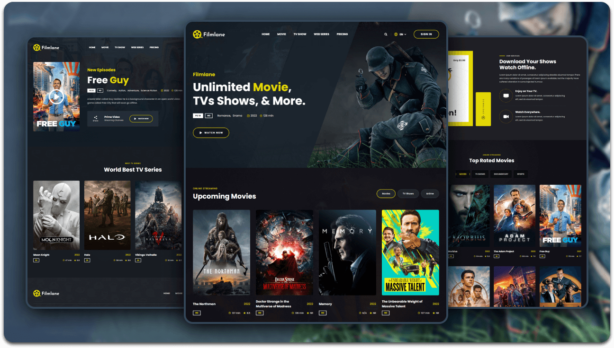

 

<!-- 🔰 BADGES -->

 

<!-- 🔰 PROJECT LOGO -->

 
 

<h1 align="center">🎬 Filmlane Film Website</h1>

A cinematic, stylish, and fully responsive  
**Film Website UI** built using **HTML, CSS, and JavaScript**.

<a href="https://filmlane-film-website.vercel.app/"><strong>➥ Live Demo</strong></a>

---

<!-- TABLE OF CONTENTS -->

  
📑 Table of Contents

  <ol>
    <li><a href="#about-the-project">About The Project</a></li>
    <li><a href="#features">Features</a></li>
    <li><a href="#built-with">Built With</a></li>
    <li><a href="#contact">Contact</a></li>
  </ol>

---

## 📖 About The Project

The **Filmlane Film Website** is a modern and immersive movie website concept designed for streaming platforms, film studios, and entertainment brands. It features a cinematic dark-themed interface, engaging layouts, and visually rich sections to showcase movies, trailers, and featured content.

The layout focuses on:
- Modern cinematic UI design  
- Featured movies and trailer showcases  
- Fully responsive experience across all devices  

This project demonstrates your ability to build **professional entertainment websites** with visually engaging layouts, intuitive navigation, and responsive front-end development.

Ideal for:
- Movie streaming platforms  
- Entertainment websites  
- Film studio landing pages  
- Cinema showcase websites  
- UI/UX and responsive design practice  

---

## ✨ Features

- Fully responsive film website layout  
- Modern dark-themed cinematic UI  
- Featured movies and trailers section  
- Smooth hover animations and transitions   
- Easy-to-customize design for entertainment projects  

---

## 🛠️ Built With

This project is built using:

- **HTML5**  
- **CSS3**  
- **JavaScript (Vanilla)**  

---

## 📬 Contact

**Muhammad Salman Arshad**

- 💼 **LinkedIn:** https://www.linkedin.com/in/muhammad-salmanarshad/  
- 🎨 **Figma:** https://www.figma.com/@codewithsalman  
- 📧 **Email:** [msalmanwebdev@gmail.com](mailto:msalmanwebdev@gmail.com)

(<a href="#top">back to top</a>)

